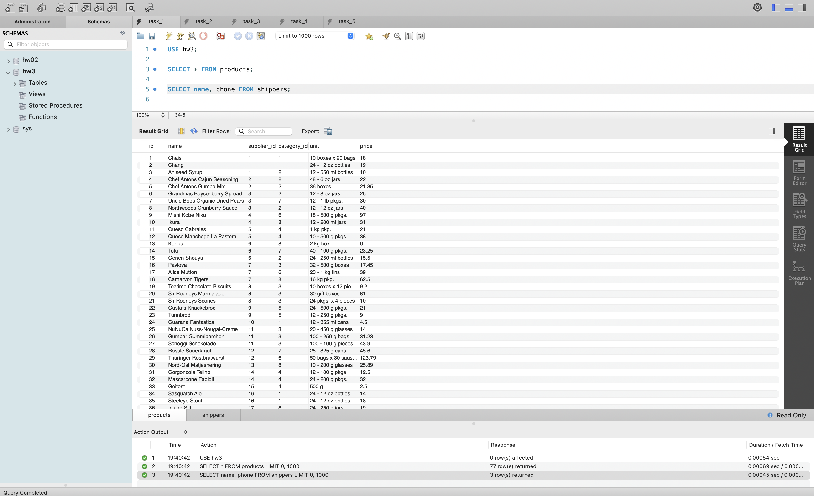
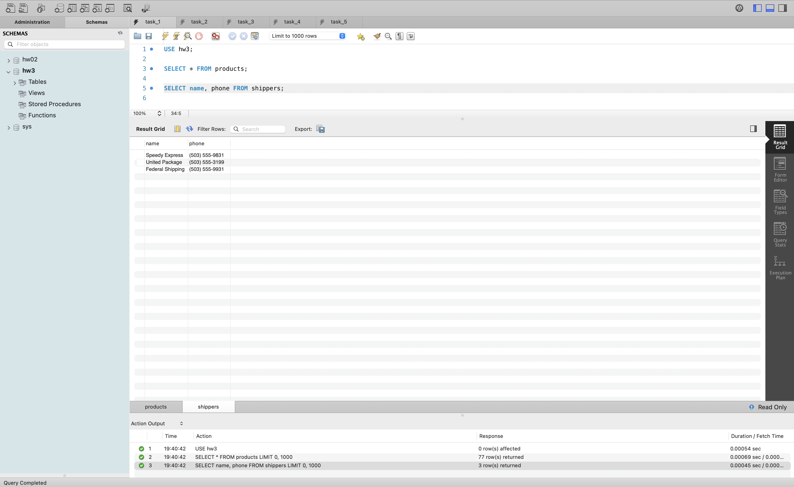
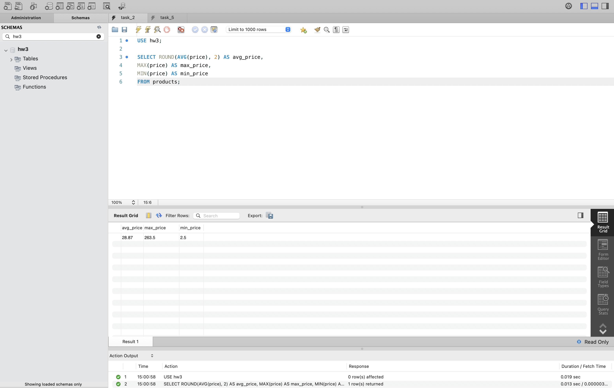
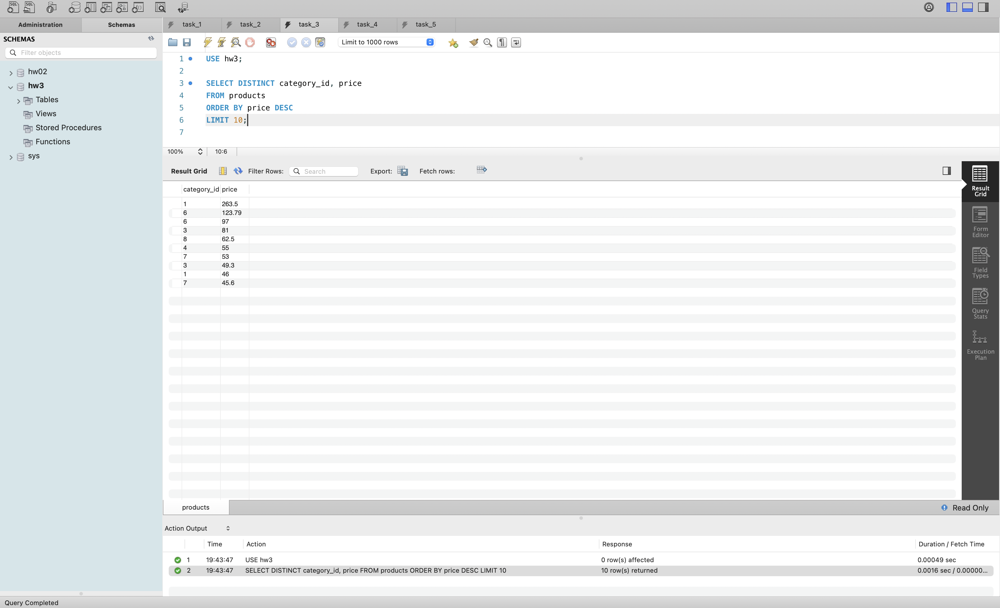
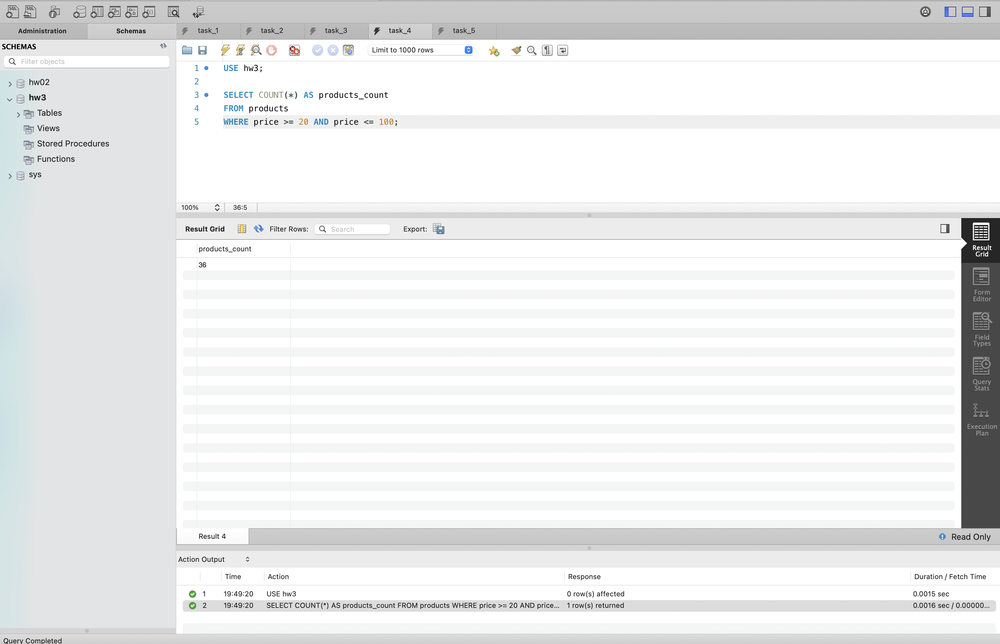
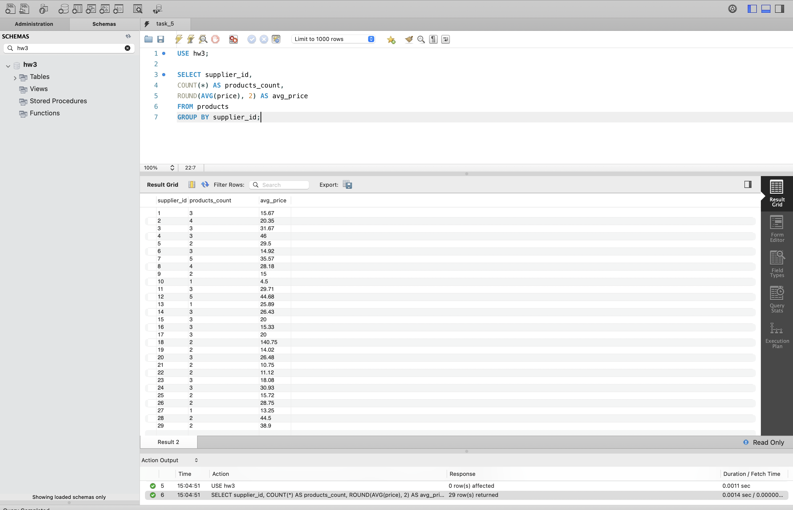

# goit-rdb-hw-03

ДЗ з РБД: SQL запити у MySQL

## Завдання №1
Вибірка всіх стовпчиків з products і стовпчиків name, phone з shippers: [task_1.sql](sql/task_1.sql)

## Завдання №2
Середнє, максимальне та мінімальне значення price у products: [task_2.sql](sql/task_2.sql)

## Завдання №3
Унікальні значення category_id та price, сортування за спаданням price, 10 рядків: [task_3.sql](sql/task_3.sql)

## Завдання №4
Кількість продуктів з ціною від 20 до 100: [task_4.sql](sql/task_4.sql)

## Завдання №5
Кількість продуктів і середня ціна для кожного supplier_id: [task_5.sql](sql/task_5.sql)

